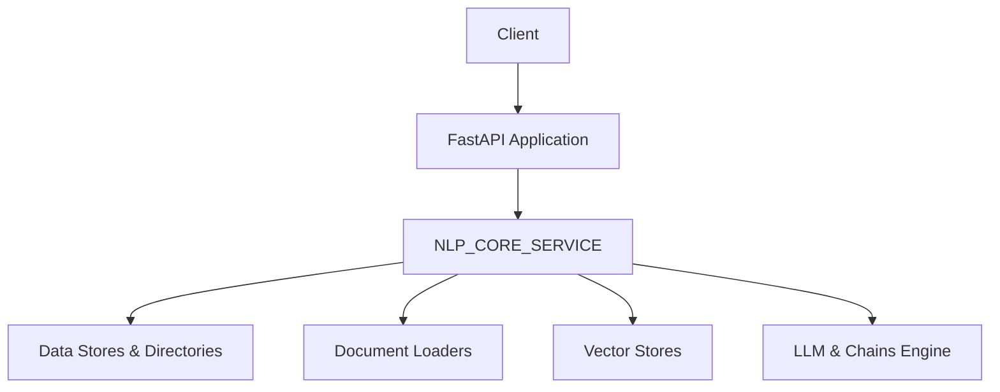

# Documentazione API

<!-- toc -->
- [1. Introduzione](#1-introduzione)
- [2. Panoramica Generale](#2-panoramica-generale)
- [3. Configurazione e Sicurezza](#3-configurazione-e-sicurezza)
- [4. Architettura e Flusso dei Dati](#4-architettura-e-flusso-dei-dati)
- [5. Endpoint dell’API](#5-endpoint-dellapi)
  - [5.1 Gestione dei Contesti](#51-gestione-dei-contesti)
    - [5.1.1 Creazione di un Nuovo Contesto (POST /contexts)](#511-creazione-di-un-nuovo-contesto-post-contexts)
    - [5.1.2 Eliminazione di un Contesto (DELETE /contexts/{context_name})](#512-eliminazione-di-un-contesto-delete-contextscontext_name)
    - [5.1.3 Recupero Informazioni di un Contesto (GET /context_info/{context_name})](#513-recupero-informazioni-di-un-contesto-get_context_infocontext_name)
    - [5.1.4 Elenco dei Contesti per Utente (POST /list_contexts)](#514-elenco-dei-contesti-per-utente-post_list_contexts)
  - [5.2 Gestione dei File](#52-gestione-dei-file)
    - [5.2.1 Caricamento di un File su Contesti Multipli (POST /upload)](#521-caricamento-di-un-file-su-contesti-multipli-post-upload)
    - [5.2.2 Elenco dei File (GET /files)](#522-elenco-dei-file-get-files)
    - [5.2.3 Eliminazione di un File (DELETE /files)](#523-eliminazione-di-un-file-delete-files)
    - [5.2.4 Download di un File (GET /download)](#524-download-di-un-file-get-download)
  - [5.3 Gestione delle Catene (Chains)](#53-gestione-delle-catene-chains)
    - [5.3.1 Configurazione e Caricamento della Chain (POST /configure_and_load_chain/)](#531-configurazione-e-caricamento-della-chain-post_configure_and_load_chain)
    - [5.3.2 Esecuzione della Chain (POST /execute_chain)](#532-esecuzione-della-chain-post_execute_chain)
    - [5.3.3 Stream della Chain (POST /stream_chain)](#533-stream-della-chain-post_stream_chain)
- [6. Modelli e Strutture Dati](#6-modelli-e-strutture-dati)
- [7. Gestione degli Errori e Codici di Stato](#7-gestione-degli-errori-e-codici-di-stato)
- [8. Considerazioni Finali](#8-considerazioni-finali)
<!-- /toc -->

---

## 1. Introduzione

Questa API è realizzata con **FastAPI** e offre una serie di funzionalità per:

- Gestire **contesti** (directory) per organizzare dati e risorse.
- Caricare, elencare ed eliminare **file** in uno o più contesti.
- Configurare e caricare **catene di elaborazione** (chains) che integrano modelli di linguaggio (LLM) e strumenti (es. vector stores e document loaders).

L’API si interfaccia con un backend (indicato dalla variabile di configurazione `NLP_CORE_SERVICE`) che si occupa della gestione dei dati, del caricamento dei modelli e dell’elaborazione documentale.

---

## 2. Panoramica Generale

Le funzionalità principali dell’API includono:

- **Contesti**: Creazione, eliminazione e recupero di informazioni riguardanti le directory, con associazione all’utente (mediante `username`).
- **File**: Operazioni di upload (con indicizzazione e configurazione automatica dei loader e vector store), listaggio e cancellazione.
- **Catene (Chains)**: Configurazione e caricamento in memoria di catene di elaborazione basate su modelli LLM, con possibilità di esecuzione sincrona e in streaming.

---

## 3. Configurazione e Sicurezza

- **Configurazione**:  
  La configurazione iniziale è caricata da un file `config.json`, che definisce:
  - `NLP_CORE_SERVICE`: L’URL del backend di supporto (gestione dei data store, document loaders, chains, ecc.).
  - `openai_api_keys`: Lista di chiavi API utilizzate per interfacciarsi con i modelli OpenAI (le chiavi vengono selezionate casualmente in fase di utilizzo).

- **CORS**:  
  È abilitato il middleware `CORSMiddleware` per permettere richieste da tutte le origini. In produzione è consigliabile limitare le origini per aumentare la sicurezza.

- **Autenticazione**:  
  Alcuni endpoint (es. creazione ed elenco contesti) richiedono i campi `username` e `token` (anche se non viene applicato un controllo formale) per associare le operazioni all’utente.

---

## 4. Architettura e Flusso dei Dati

Di seguito un diagramma di alto livello che mostra come l’API si interfaccia con il backend e i vari componenti:



**Descrizione del flusso:**
- Il **client** invia richieste all’applicazione FastAPI.
- FastAPI processa la richiesta e, se necessario, effettua chiamate asincrone tramite `httpx` al servizio indicato da `NLP_CORE_SERVICE`.
- Il backend gestisce le operazioni sui **data stores** (creazione/eliminazione directory, gestione file), la configurazione dei **document loaders** e dei **vector stores**, e infine il caricamento ed esecuzione dei **modelli LLM** e delle **chain**.

---

## 5. Endpoint dell’API

### 5.1 Gestione dei Contesti

I **contesti** rappresentano delle directory di lavoro (con metadati opzionali) e vengono usati per organizzare i file e le catene in base all’utente o al progetto.

#### 5.1.1 Creazione di un Nuovo Contesto (POST /contexts)

- **Descrizione**:  
  Crea un nuovo contesto (directory) sul backend. Il nome del contesto viene concatenato con lo username dell’utente per garantire unicità.

- **Endpoint**:  
  ```
  POST /contexts
  ```

- **Request Body (JSON)**:

  ```json
  {
    "username": "mario.rossi",
    "token": "esempioToken",
    "context_name": "project_alpha",
    "description": "Contesto per il progetto Alpha"
  }
  ```

- **Schema**:  
  Modello `CreateContextRequest` con i campi:
  - `username` (string, obbligatorio)
  - `token` (string, obbligatorio)
  - `context_name` (string, obbligatorio)
  - `description` (string, opzionale)

- **Esempio di richiesta con cURL**:

  ```bash
  curl -X POST "http://your-api-url/llm-rag/contexts" \
       -H "Content-Type: application/json" \
       -d '{
             "username": "mario.rossi",
             "token": "esempioToken",
             "context_name": "project_alpha",
             "description": "Contesto per il progetto Alpha"
           }'
  ```

- **Esempio di risposta**:

  ```json
  {
    "path": "mario.rossi-project_alpha",
    "custom_metadata": {
      "description": "Contesto per il progetto Alpha"
    }
  }
  ```

---

#### 5.1.2 Eliminazione di un Contesto (DELETE /contexts/{context_name})

- **Descrizione**:  
  Elimina un contesto (directory) esistente e tutte le risorse ad esso associate.

- **Endpoint**:  
  ```
  DELETE /contexts/{context_name}
  ```

- **Path Parameter**:
  - `context_name`: Nome del contesto da eliminare (es. `mario.rossi-project_alpha`).

- **Esempio di richiesta con cURL**:

  ```bash
  curl -X DELETE "http://your-api-url/llm-rag/contexts/mario.rossi-project_alpha"
  ```

- **Esempio di risposta**:

  ```json
  {
    "detail": "Contesto 'mario.rossi-project_alpha' eliminato con successo."
  }
  ```

---

#### 5.1.3 Recupero Informazioni di un Contesto (GET /context_info/{context_name})

- **Descrizione**:  
  Recupera le informazioni e i metadati associati a un singolo contesto.

- **Endpoint**:  
  ```
  GET /context_info/{context_name}
  ```

- **Path Parameter**:
  - `context_name`: Nome del contesto.

- **Esempio di richiesta**:

  ```bash
  curl -X GET "http://your-api-url/llm-rag/context_info/mario.rossi-project_alpha"
  ```

- **Esempio di risposta**:

  ```json
  {
    "path": "mario.rossi-project_alpha",
    "custom_metadata": {
      "description": "Contesto per il progetto Alpha"
    }
  }
  ```

---

#### 5.1.4 Elenco dei Contesti per Utente (POST /list_contexts)

- **Descrizione**:  
  Recupera l’elenco di tutti i contesti disponibili per un utente specifico. Vengono filtrati i contesti in base allo username (che deve essere prefissato nel path del contesto).

- **Endpoint**:  
  ```
  POST /list_contexts
  ```

- **Request Body (JSON)**:

  ```json
  {
    "username": "mario.rossi",
    "token": "esempioToken"
  }
  ```

- **Schema**:  
  Modello `ListContextsRequest` con:
  - `username` (string, obbligatorio)
  - `token` (string, obbligatorio)

- **Esempio di richiesta con cURL**:

  ```bash
  curl -X POST "http://your-api-url/llm-rag/list_contexts" \
       -H "Content-Type: application/json" \
       -d '{
             "username": "mario.rossi",
             "token": "esempioToken"
           }'
  ```

- **Esempio di risposta**:

  ```json
  [
    {
      "path": "project_alpha",
      "custom_metadata": {
        "description": "Contesto per il progetto Alpha"
      }
    },
    {
      "path": "project_beta",
      "custom_metadata": null
    }
  ]
  ```

---

### 5.2 Gestione dei File

Questi endpoint permettono il caricamento, l’elenco e la cancellazione dei file associati ai contesti.

#### 5.2.1 Caricamento di un File su Contesti Multipli (POST /upload)

- **Descrizione**:  
  Carica un file (ad es. PDF, DOCX, immagine, ecc.) e lo associa a uno o più contesti. Durante l’upload, il file viene processato per configurare automaticamente il **document loader** e il **vector store** per l’indicizzazione.

- **Endpoint**:  
  ```
  POST /upload
  ```

- **Parametri (Form Data)**:
  - `file` (obbligatorio): Il file da caricare.
  - `contexts` (obbligatorio): Lista di contesti (può essere passato come stringa separata da virgole).
  - `description` (opzionale): Descrizione del file.

- **Esempio di richiesta con cURL**:

  ```bash
  curl -X POST "http://your-api-url/llm-rag/upload" \
       -F "file=@/path/to/document.pdf" \
       -F "contexts=project_alpha,project_beta" \
       -F "description=Documento di esempio"
  ```

- **Esempio di risposta**:

  ```json
  {
    "file_id": "a1b2c3d4-e5f6-7890-abcd-1234567890ab",
    "contexts": ["project_alpha", "project_beta"]
  }
  ```

> **Nota Tecnica:**  
> L’upload prevede operazioni di configurazione del loader (con scelta dinamica in base all’estensione del file) e del vector store. Viene generato un UUID univoco per il file e per ogni contesto viene inviata una richiesta separata al backend.

---

#### 5.2.2 Elenco dei File (GET /files)

- **Descrizione**:  
  Recupera l’elenco dei file presenti in uno o più contesti. Se non si specificano contesti, vengono restituiti tutti i file.

- **Endpoint**:  
  ```
  GET /files
  ```

- **Query Parameter**:
  - `contexts` (opzionale): Lista di contesti da filtrare (es. `contexts=project_alpha&contexts=project_beta`).

- **Esempio di richiesta con cURL**:

  ```bash
  curl -X GET "http://your-api-url/llm-rag/files?contexts=project_alpha&contexts=project_beta"
  ```

- **Esempio di risposta**:

  ```json
  [
    {
      "path": "project_alpha/document.pdf",
      "custom_metadata": {
        "file_uuid": "a1b2c3d4-e5f6-7890-abcd-1234567890ab",
        "description": "Documento di esempio"
      }
    },
    {
      "path": "project_beta/image.png",
      "custom_metadata": {
        "file_uuid": "b2c3d4e5-f678-9012-abcd-234567890abc",
        "description": "Immagine campione"
      }
    }
  ]
  ```

---

#### 5.2.3 Eliminazione di un File (DELETE /files)

- **Descrizione**:  
  Elimina un file specifico. È possibile indicare il file tramite il suo UUID (eliminazione da tutti i contesti) oppure tramite il percorso (eliminazione solo da un contesto specifico).

- **Endpoint**:  
  ```
  DELETE /files
  ```

- **Query Parameters**:
  - `file_id` (opzionale): UUID del file.
  - `file_path` (opzionale): Percorso completo del file (es. `project_alpha/document.pdf`).

- **Esempio di richiesta (eliminazione tramite UUID)**:

  ```bash
  curl -X DELETE "http://your-api-url/llm-rag/files?file_id=a1b2c3d4-e5f6-7890-abcd-1234567890ab"
  ```

- **Esempio di richiesta (eliminazione tramite percorso)**:

  ```bash
  curl -X DELETE "http://your-api-url/llm-rag/files?file_path=project_alpha/document.pdf"
  ```

- **Esempio di risposta**:

  ```json
  {
    "detail": "File with ID a1b2c3d4-e5f6-7890-abcd-1234567890ab deleted from all contexts"
  }
  ```

---

#### 5.2.4 Download di un File (GET /download)

- **Descrizione**:  
  Consente di scaricare un file presente nel sistema. Il file viene recuperato dal backend tramite uno streaming che inoltra le intestazioni (Content-Type, Content-Disposition).

- **Endpoint**:  
  ```
  GET /download
  ```

- **Query Parameter**:
  - `file_id`: Identificativo (o percorso) del file da scaricare.

- **Esempio di richiesta**:

  ```bash
  curl -X GET "http://your-api-url/llm-rag/download?file_id=a1b2c3d4-e5f6-7890-abcd-1234567890ab" --output downloaded_file.pdf
  ```

- **Risposta**:  
  Lo stream del file verrà restituito con le intestazioni corrette per il download.

---

### 5.3 Gestione delle Catene (Chains)

Le **chain** rappresentano processi di elaborazione che utilizzano modelli LLM (es. GPT-4) in combinazione con strumenti (vector store, MongoDBTools, ecc.) per operazioni quali Q&A, ricerca semantica e altro.

#### 5.3.1 Configurazione e Caricamento della Chain (POST /configure_and_load_chain/)

- **Descrizione**:  
  Configura e carica in memoria una chain di elaborazione. L’endpoint prevede:
  - Il caricamento di un modello LLM (tramite `load_model`).
  - La configurazione della chain (definizione di system message, strumenti da utilizzare, ecc.).
  - Il caricamento effettivo della chain nel sistema backend.

- **Endpoint**:  
  ```
  POST /configure_and_load_chain/
  ```

- **Request Body (JSON)**:

  ```json
  {
    "contexts": ["project_alpha"],
    "model_name": "gpt-4o-mini"
  }
  ```

- **Schema**:  
  Modello `ConfigureAndLoadChainInput` con:
  - `contexts`: Lista di contesti (obbligatoria, anche se può essere vuota).
  - `model_name`: Nome del modello LLM (opzionale, default "gpt-4o").

- **Esempio di richiesta con cURL**:

  ```bash
  curl -X POST "http://your-api-url/llm-rag/configure_and_load_chain/" \
       -H "Content-Type: application/json" \
       -d '{
             "contexts": ["project_alpha"],
             "model_name": "gpt-4o-mini"
           }'
  ```

- **Esempio di risposta**:

  ```json
  {
    "message": "Chain configurata e caricata con successo.",
    "llm_load_result": {
      "status": "success",
      "model": "chat-openai_gpt-4o-mini"
    },
    "config_result": {
      "chain_id": "project_alpha_agent_with_tools",
      "status": "configured"
    },
    "load_result": {
      "chain_id": "project_alpha_agent_with_tools",
      "status": "loaded"
    }
  }
  ```

---

#### 5.3.2 Esecuzione della Chain (POST /execute_chain)

- **Descrizione**:  
  Esegue la chain configurata fornendo un input di query. Questo endpoint viene utilizzato per ottenere una risposta elaborata dal modello LLM in combinazione con gli strumenti configurati.

- **Endpoint**:  
  ```
  POST /execute_chain
  ```

- **Query Parameter**:
  - `chain_id` (string, obbligatorio): Identificativo univoco della chain da eseguire.

- **Request Body (JSON)**:  
  Un oggetto JSON contenente il campo `input` e, opzionalmente, lo storico della conversazione (`chat_history`).

  ```json
  {
    "input": "Qual è il mio nome?",
    "chat_history": []
  }
  ```

- **Esempio di richiesta con cURL**:

  ```bash
  curl -X POST "http://your-api-url/llm-rag/execute_chain?chain_id=project_alpha_agent_with_tools" \
       -H "Content-Type: application/json" \
       -d '{
             "input": "Qual è il mio nome?",
             "chat_history": []
           }'
  ```

- **Esempio di risposta**:

  ```json
  {
    "result": "Risposta generata dal modello LLM in base alla query"
  }
  ```

---

#### 5.3.3 Stream della Chain (POST /stream_chain)

- **Descrizione**:  
  Avvia una esecuzione in modalità streaming della chain, utile per ricevere la risposta a blocchi (chunk) in tempo reale.

- **Endpoint**:  
  ```
  POST /stream_chain
  ```

- **Query Parameter**:
  - `chain_id` (string, obbligatorio): Identificativo della chain da eseguire.

- **Request Body (JSON)**:

  ```json
  {
    "input": "Dimmi una curiosità su Roma.",
    "chat_history": []
  }
  ```

- **Esempio di richiesta con cURL**:

  ```bash
  curl -X POST "http://your-api-url/llm-rag/stream_chain?chain_id=project_alpha_agent_with_tools" \
       -H "Content-Type: application/json" \
       -d '{
             "input": "Dimmi una curiosità su Roma.",
             "chat_history": []
           }'
  ```

- **Risposta**:  
  La risposta verrà fornita in modalità streaming, inviando i chunk di testo non appena disponibili.

---

## 6. Modelli e Strutture Dati

### 6.1 ContextMetadata

Utilizzato per rappresentare i metadati associati a un contesto.

```json
{
  "path": "mario.rossi-project_alpha",
  "custom_metadata": {
    "description": "Contesto per il progetto Alpha"
  }
}
```

### 6.2 FileUploadResponse

Definisce la risposta dopo il caricamento di un file.

```json
{
  "file_id": "a1b2c3d4-e5f6-7890-abcd-1234567890ab",
  "contexts": ["project_alpha", "project_beta"]
}
```

### 6.3 ConfigureAndLoadChainInput

Modello utilizzato per configurare e caricare una chain.

```json
{
  "contexts": ["project_alpha"],
  "model_name": "gpt-4o-mini"
}
```

---

## 7. Gestione degli Errori e Codici di Stato

L’API utilizza il modulo `HTTPException` di FastAPI per restituire errori dettagliati. I codici di stato più comuni includono:

- **200 OK**: Richiesta eseguita correttamente.
- **400 Bad Request**: Parametri mancanti o non validi.
- **403 Forbidden**: L’utente non è autorizzato ad accedere alla risorsa richiesta.
- **404 Not Found**: Risorsa non trovata.
- **500 Internal Server Error**: Errore lato server.

In caso di errore, la risposta avrà una struttura simile a:

```json
{
  "detail": "Messaggio di errore dettagliato."
}
```
